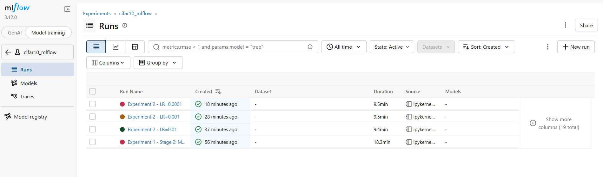
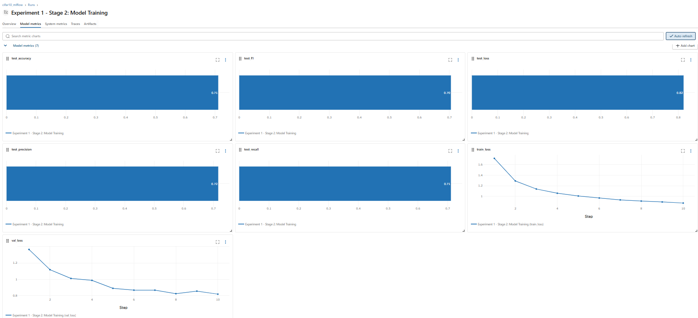
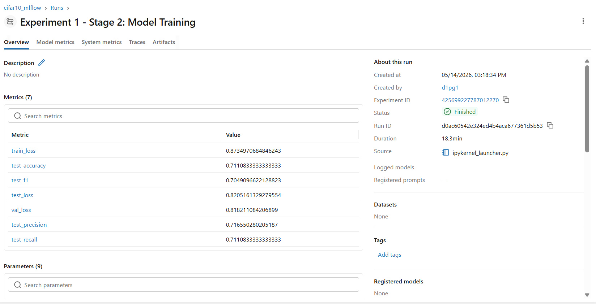
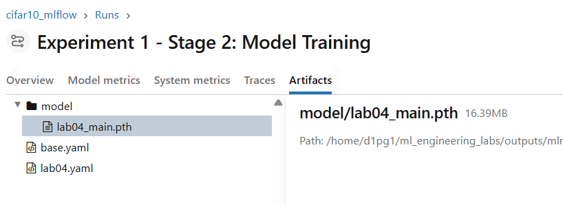
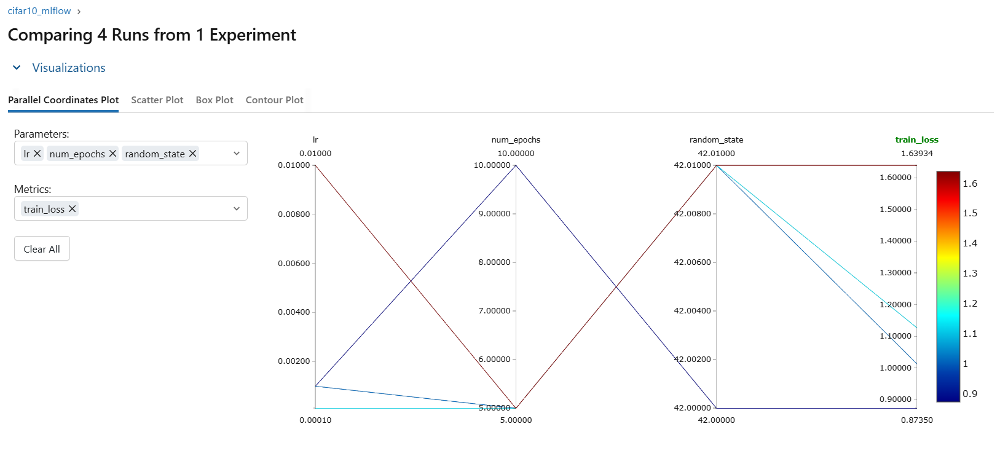

# Lab Report: MLflow Experiment Tracking and Artifact Management

**Course:** ML Operations  
**Lab:** Assignment 4  
**Submission Date:** 2026-05-14

---

## Introduction

Modern machine learning projects involve hundreds of experiments — different architectures, hyperparameter combinations, data preprocessing choices — and keeping track of what was tried, what worked, and what the results were quickly becomes unmanageable with ad-hoc tooling (spreadsheets, print statements, manually-named checkpoint files). Experiment tracking systems solve this by automatically recording every run's parameters, metrics, code state, and output artifacts in a queryable store.

**MLflow** is an open-source platform for the complete ML lifecycle. Its tracking component provides a simple API (`mlflow.log_param`, `mlflow.log_metric`, `mlflow.log_artifact`) that integrates with any Python training code without forcing framework lock-in. Runs are stored in a local file-based backend (or a remote server) and browsable through the MLflow UI — a web dashboard that lets you compare runs side-by-side, visualise metric curves, and download saved models.

This lab integrates MLflow 3.12.0 into the existing CIFAR-10 CNN pipeline (built in Labs 1–3) to demonstrate reproducible experiment management.

---

## Tracking Server Setup

MLflow supports both a **file-based local backend** (used in this lab) and a **remote server** (shared team use). The tracking URI `outputs/mlruns` tells MLflow to write all metadata to a local directory, requiring no running process for recording runs.

```python
mlflow.set_tracking_uri("outputs/mlruns")
mlflow.set_experiment("cifar10_mlflow")
```

To launch the MLflow UI and browse recorded runs interactively, run:

```bash
mlflow server \
  --backend-store-uri outputs/mlruns \
  --default-artifact-root outputs/mlruns \
  --host 0.0.0.0 \
  --port 5000
```

The experiment `cifar10_mlflow` groups all Lab 4 runs under one namespace, keeping them separate from any runs from other labs or future experiments. The `.gitignore` already excludes `outputs/mlruns/` so the tracking metadata is not committed to version control.

The screenshot below shows the MLflow UI after all runs completed — all 4 runs have a green "Finished" status, confirming the server correctly recorded every experiment:



The run durations confirm the training cost: the main 10-epoch run took **18.3 min** while the three 5-epoch sweep runs each took **~9.4–9.5 min** on CPU.

---

## Logging Details

Each run logs the following information:

### Parameters (logged at run start via `mlflow.log_params`)

| Parameter | Value (main run) | Description |
|-----------|-----------------|-------------|
| `lr` | 0.001 | Learning rate |
| `batch_size` | 128 | Mini-batch size |
| `num_epochs` | 10 | Training epochs |
| `optimizer` | Adam | Optimiser class |
| `test_size` | 0.2 | Test split fraction |
| `val_size` | 0.2 | Validation split fraction |
| `random_state` | 42 | Random seed |
| `n_classes` | 10 | CIFAR-10 classes |
| `model` | CifarCNN | Model architecture |

### Metrics (logged per epoch via `mlflow.log_metric`)

| Metric | Logging interval | Description |
|--------|-----------------|-------------|
| `train_loss` | Every epoch | Average cross-entropy loss over training batches |
| `val_loss` | Every epoch | Average cross-entropy loss on validation set |
| `test_accuracy` | End of run | Classification accuracy on held-out test set (main run: **71.11%**) |
| `test_precision` | End of run | Weighted precision (main run: 71.66%) |
| `test_recall` | End of run | Weighted recall (main run: 71.11%) |
| `test_f1` | End of run | Weighted F1 score (main run: 70.49%) |
| `test_loss` | End of run | Cross-entropy on test set (main run: 0.8205) |

The screenshot below shows the **Model metrics tab** for the main run. The `train_loss` curve drops from ~1.7 at epoch 1 to ~0.87 at epoch 10, and `val_loss` falls from ~1.3 to ~0.82, with both curves showing smooth, consistent convergence — evidence that the model is learning without overfitting over 10 epochs:



The **Overview tab** confirms the exact metric values recorded for the main run alongside the run metadata (Run ID, creation timestamp, duration, source):



### Artifacts (logged via `mlflow.log_artifact`)

| Artifact | Size | Description |
|----------|------|-------------|
| `configs/base.yaml` | — | Full configuration file for reproducibility |
| `configs/lab04.yaml` | — | Lab-specific sweep config |
| `model/lab04_main.pth` | 16.39 MB | Best model checkpoint (saved on lowest val loss) |

The Artifacts tab below shows all three artifacts stored under the main run. The `model/lab04_main.pth` checkpoint (16.39 MB) can be downloaded directly from the UI or retrieved programmatically via `mlflow.artifacts.download_artifacts()`:



---

## Experimentation Process

### Main Run — `Experiment 1 - Stage 2: Model Training`

A full 10-epoch training run with the default configuration (`lr=0.001`, `batch_size=128`). The run name follows the hierarchical convention: `"Experiment 1 - Stage N: <stage description>"`.

After training, the best model checkpoint is logged as an artifact. The artifact retrieval cell in the notebook demonstrates the full round-trip: `mlflow.artifacts.download_artifacts()` → `load_state_dict()` → inference on a test batch — confirming the stored model is functional and deployment-ready.

### Hyperparameter Sweep — `Experiment 2 - LR=*`

Three shorter runs (5 epochs each) varying only the learning rate across `[0.01, 0.001, 0.0001]`. Each run uses the hierarchical naming convention `"Experiment 2 - LR=<value>"`.

**Sweep results summary:**

| Run Name | LR | Epochs | Test Accuracy | Test F1 | Test Loss |
|----------|----|--------|--------------|---------|-----------|
| Experiment 1 - Stage 2: Model Training | 0.001 | 10 | **71.11%** | 0.7049 | 0.8205 |
| Experiment 2 - LR=0.001 | 0.001 | 5 | 65.65% | 0.6522 | 0.9740 |
| Experiment 2 - LR=0.0001 | 0.0001 | 5 | 64.97% | 0.6416 | 1.0002 |
| Experiment 2 - LR=0.01 | 0.01 | 5 | 38.73% | 0.3551 | 1.5625 |

The **Parallel Coordinates Plot** below (from the MLflow Compare view) visualises how each combination of `lr` and `num_epochs` maps to the final `train_loss`. Lines are colour-coded from dark red (high loss ~1.6) to dark blue (low loss ~0.87):



**Key observations:**
- **LR=0.01** produced the worst result at 5 epochs (38.7%) and the highest final train_loss — visible as the red line in the parallel coordinates plot. A learning rate this large causes the optimiser to overshoot minima.
- **LR=0.001 and LR=0.0001** both reached ~65% at 5 epochs, nearly tied. LR=0.0001 converges more slowly but stably; with more epochs it could match or exceed LR=0.001.
- The main 10-epoch run at LR=0.001 reaches **71.1%** — 5.5 percentage points above the equivalent 5-epoch run — confirming that epoch count matters as much as learning rate at this scale.
- The `val_loss`-based checkpoint selection correctly saved the best generalising model state, not just the last epoch's weights.

The `mlflow.search_runs()` API call at the end of the notebook returns a Pandas DataFrame of all runs, sorted by `test_accuracy` — enabling programmatic selection of the best configuration without manual UI inspection.

---

## Reflection

### Benefits

**Reproducibility:** Every run records the exact parameters used (all 9 logged in this lab), making it trivial to re-run any past experiment or understand why a model performed the way it did months later.

**Comparison at scale:** The MLflow UI's Parallel Coordinates and metric charts make multi-run comparison instant. The divergence of LR=0.01 is immediately visible in the colour-coded plot — without MLflow this would require manually loading 4 separate log files.

**Artifact registry:** Logging `lab04_main.pth` (16.39 MB) as an artifact ties the model to its exact run context. The artifact download API makes it straightforward to load any past model for re-evaluation or deployment without knowing its file path.

**Zero framework lock-in:** The `mlflow_trainer.py` wrapper adds only 3 extra lines (`mlflow.log_metric`) to the standard training loop. The core training code in `trainer.py` (used by the DVC pipeline) was not modified.

### Challenges

**CPU training overhead:** Each epoch takes ~2 min on CPU, so the full lab (10 + 3×5 = 25 epochs) took ~47 min total. A GPU would reduce this 10–20×.

**Local-only tracking:** The file-based backend works well for individual work but doesn't support team collaboration. A remote MLflow server with a PostgreSQL backend would be needed for shared access.

**No automatic DVC integration:** MLflow and DVC are complementary but not automatically linked. The DVC pipeline (`dvc.yaml`) and MLflow tracking run independently; bridging them requires explicit tagging (e.g. recording the DVC commit hash in each MLflow run).

### Suggested Improvements

1. **Remote tracking server** with a shared database backend for team experiments.
2. **MLflow Model Registry** to promote the best run to "Production" stage with a single API call.
3. **MLflow Projects** (`MLproject` file) to make the entire experiment runnable with `mlflow run .`, enabling fully self-contained reproducibility.
4. **DVC + MLflow integration** by adding `mlflow.set_tag("dvc_commit", git_rev_parse_HEAD)` at the start of each run.
