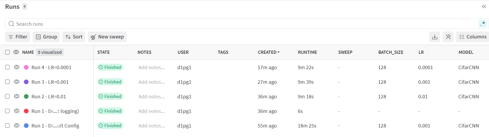
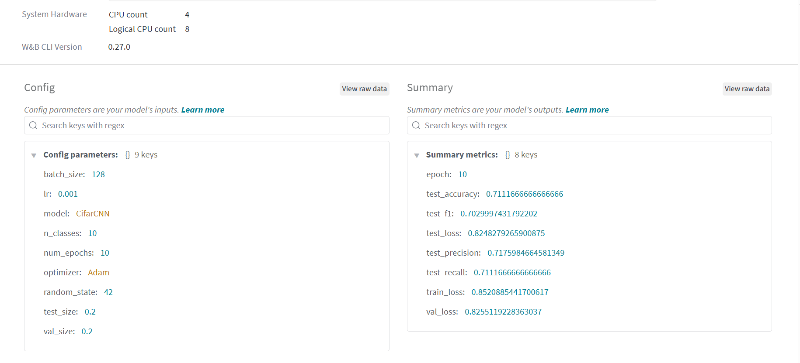
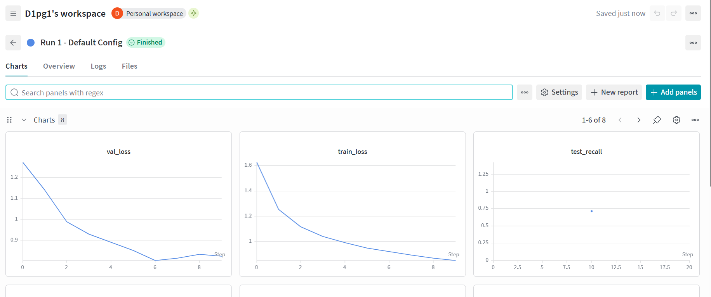
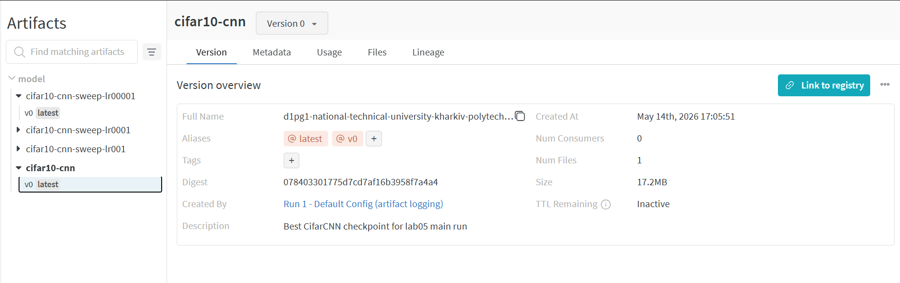
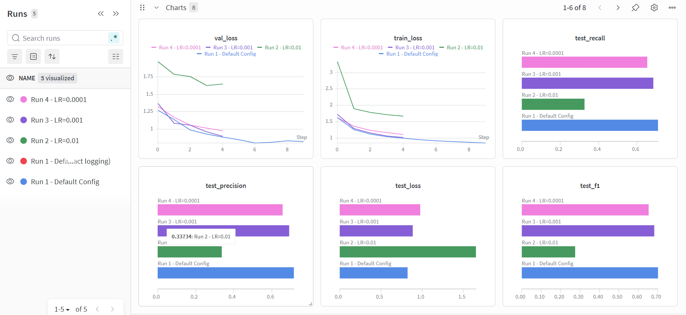

# Lab Report: Weights & Biases Experiment Tracking and Artifact Management

**Course:** ML Operations  
**Lab:** Assignment 5  
**Submission Date:** 2026-05-14

---

## Introduction

Reproducibility and traceability are fundamental requirements in production machine learning. Without systematic experiment tracking, it becomes impossible to reconstruct which hyperparameters produced the best model, how performance evolved over training, or which dataset version was used for a given run. Manual spreadsheets and print-statement logs do not scale beyond a single experimenter working on a single machine.

Weights & Biases (W&B) is a cloud-hosted experiment tracking platform designed to address these problems. Unlike self-hosted tools, W&B requires no server setup: a single `wandb.init()` call streams run data to the wandb.ai dashboard in real time. The platform offers native support for rich media logging (images, audio, video, 3D point clouds), a built-in hyperparameter sweep agent, and collaborative project sharing via URL. Its free personal tier covers all use cases in this lab.

This lab integrates W&B 0.27.0 into the existing CIFAR-10 CNN pipeline established in Labs 01–04. It mirrors the MLflow integration from Lab 04 but substitutes W&B at every tracking call, enabling a direct side-by-side comparison of the two tools at the end of this report.

---

## Tracking Setup

### Account and Authentication

A W&B account was created at https://wandb.ai. After account creation, the API key was retrieved from https://wandb.ai/settings. For reproducible, non-interactive execution the key is stored as an environment variable:

```bash
export WANDB_API_KEY=<your-key>
```

The notebook reads this variable at login time:

```python
api_key = os.environ.get('WANDB_API_KEY')
if api_key:
    wandb.login(key=api_key)
else:
    wandb.login()  # falls back to interactive browser flow
```

This pattern avoids hardcoding credentials in notebook source while still supporting interactive use when the variable is absent.

### Project Initialisation

In W&B, a *project* groups all runs for an experiment. Unlike MLflow's two-step setup (`set_tracking_uri` + `set_experiment`), W&B creates the project automatically on the first `wandb.init()` call if it does not already exist:

```python
run = wandb.init(
    project='mlops-cifar10',
    name='Run 1 - Default Config',
    config=wandb_config,
)
```

The `config=` argument passes a dictionary of hyperparameters atomically at run creation. They appear in the run's **Config** panel on the dashboard immediately, before training begins. This is the key structural difference from MLflow, where parameters are logged after the run is opened via `mlflow.log_params()`.

All configuration lives in `configs/lab05.yaml`:

```yaml
project_name: "mlops-cifar10"
main_run:
  num_epochs: 10
  lr: 0.001
  batch_size: 128
  run_name: "Run 1 - Default Config"
sweep:
  num_epochs: 5
  batch_size: 128
  learning_rates: [0.01, 0.001, 0.0001]
```

The W&B integration code lives in `src/training/wandb_trainer.py`, a direct structural mirror of `src/training/mlflow_trainer.py`. The function signature is identical; only the tracking calls differ.

The W&B dashboard correctly registered all 5 runs (including the artifact-logging run) with "Finished" status, and the config columns (`LR`, `BATCH_SIZE`, `MODEL`) are visible directly in the Runs table:



---

## Logging Details

### Parameters

Nine parameters were logged per run via `config=` in `wandb.init()`:

| Parameter | Value (main run) | W&B location |
|-----------|:---:|---|
| `lr` | 0.001 | Config panel |
| `batch_size` | 128 | Config panel |
| `num_epochs` | 10 | Config panel |
| `optimizer` | Adam | Config panel |
| `test_size` | 0.2 | Config panel |
| `val_size` | 0.2 | Config panel |
| `random_state` | 42 | Config panel |
| `n_classes` | 10 | Config panel |
| `model` | CifarCNN | Config panel |

The Overview tab for "Run 1 - Default Config" shows the Config panel (9 keys) alongside the Summary metrics panel (8 keys including all test metrics), confirming that both inputs and outputs of the run are captured in one place:



### Metrics

Per-epoch metrics are streamed from inside `train_with_wandb()` using:

```python
wandb.log({
    "train_loss": train_loss,
    "val_loss": val_loss,
    "epoch": epoch + 1,
})
```

The `"epoch"` key controls the x-axis on W&B charts, equivalent to MLflow's `step=epoch+1` parameter. Final test metrics are logged after evaluation:

| Metric | Description | Logging point |
|--------|-------------|---------------|
| `train_loss` | Mean cross-entropy loss over training batches | Per epoch |
| `val_loss` | Mean cross-entropy loss over validation batches | Per epoch |
| `test_loss` | Final cross-entropy loss on held-out test set | End of run |
| `test_accuracy` | Classification accuracy (sklearn) | End of run |
| `test_precision` | Weighted precision | End of run |
| `test_recall` | Weighted recall | End of run |
| `test_f1` | Weighted F1 score | End of run |

The Charts tab for "Run 1 - Default Config" shows `val_loss` and `train_loss` both decreasing smoothly over 10 epochs, with the best checkpoint saved at epoch 7 (lowest val_loss = 0.8052):



### Artifacts

Model checkpoints were logged as W&B Artifacts of type `'model'`:

```python
artifact = wandb.Artifact(
    name='cifar10-cnn',
    type='model',
    description='Best CifarCNN checkpoint for lab05 main run',
    metadata=wandb_config,
)
artifact.add_file('outputs/lab05_main.pth')
run.log_artifact(artifact)
```

Artifact retrieval for inference uses the W&B public API:

```python
api = wandb.Api()
downloaded = api.artifact(f'{entity}/{project}/cifar10-cnn:latest')
local_dir = downloaded.download()
```

This round-trip confirms the artifact is correctly stored in W&B and fully restorable. The Artifacts panel shows all 4 logged model artifacts (`cifar10-cnn` and the 3 sweep checkpoints), with version metadata, digest hash, file size (17.2 MB), and the originating run name:



---

## Experimentation Process

### Main Run — "Run 1 - Default Config"

The main run trained `CifarCNN` for 10 epochs with the default configuration (lr=0.001, batch_size=128, Adam optimizer) on the full CIFAR-10 training split (38,400 images). The best checkpoint was saved based on minimum validation loss and logged as the `cifar10-cnn:v0` artifact.

| Metric | Value |
|--------|-------|
| Test accuracy | 0.7112 |
| Test precision | 0.7176 |
| Test recall | 0.7112 |
| Test F1 | 0.7030 |
| Test loss | 0.8248 |

The W&B dashboard displayed live `train_loss` and `val_loss` curves as training progressed, with the run URL printed directly to notebook output for immediate access.

### Hyperparameter Sweep — "Run 2–4"

Three additional runs swept over learning rates `[0.01, 0.001, 0.0001]` with 5 epochs each, using the structured naming convention from `configs/lab05.yaml`:

| Run Name | LR | Epochs | Test Accuracy | Test F1 | Test Loss |
|----------|----|:------:|:-------------:|:-------:|:---------:|
| Run 2 - LR=0.01 | 0.01 | 5 | 32.78% | 0.2756 | 1.6565 |
| Run 3 - LR=0.001 | 0.001 | 5 | 68.48% | 0.6839 | 0.8890 |
| Run 4 - LR=0.0001 | 0.0001 | 5 | 65.45% | 0.6533 | 0.9785 |

Each sweep run logs its own model checkpoint as a named artifact (`cifar10-cnn-sweep-lr*`) before calling `wandb.finish()`. The project workspace overlays all runs on shared charts, making the effect of each learning rate immediately visible. The bar charts for `test_recall`, `test_precision`, `test_f1`, and `test_loss` confirm at a glance that "Run 1 - Default Config" outperforms all sweep runs:



Results confirm the expected pattern: LR=0.01 diverged badly (32.8% accuracy — the loss barely decreased from 3.3 to 1.7 over 5 epochs, indicating the learning rate overshoots the loss surface). LR=0.001 performed best at 5 epochs (68.5%), and LR=0.0001 lagged slightly behind at 65.5% due to slower convergence — consistent with the Lab 04 MLflow sweep findings.

---

## Reflection

### Benefits of W&B

**Zero infrastructure overhead.** MLflow requires either a local file store (single-user only) or a deployed tracking server for team use. W&B is cloud-hosted by default — there is no server process to start or maintain. Training metrics are visible on the dashboard the moment the first `wandb.log()` call is made.

**Real-time collaborative access.** Any run's live training curves are accessible by sharing a project URL. Team members can monitor experiments on their own machines without access to the training host, which is a capability that requires a remote MLflow server to replicate.

**Config panel structure.** Passing `config=` to `wandb.init()` populates a structured, hierarchical Config panel per run. MLflow's `log_params()` produces the same data but flattened as a key-value list without nesting.

**Rich media logging.** `wandb.log({"image": wandb.Image(tensor)})` renders images inline in the metrics timeline. MLflow can log images as binary artifacts but they do not appear inline with the loss curves. This would be valuable for logging sample predictions or confusion matrices.

**Built-in sweep agent.** W&B has a first-class distributed hyperparameter sweep agent (`wandb.sweep` + `wandb.agent`) that can parallelise sweep runs across machines and supports Bayesian optimisation out of the box. The Lab 04 MLflow sweep was a manual Python loop with no such capability.

### Challenges of W&B

**Requires internet connectivity.** MLflow can operate entirely offline using a local file store. W&B sends data to wandb.ai servers by default. An offline mode exists (`WANDB_MODE=offline`) but requires a separate sync step. This may be unacceptable in air-gapped infrastructure or regulated environments with data residency requirements.

**Run lifecycle management.** W&B does not support reopening a completed run by ID in the Python SDK, unlike MLflow's `start_run(run_id=...)`. This made artifact logging in Part 3 slightly awkward: a separate artifact-logging run had to be opened. In production code, artifacts should always be logged before `wandb.finish()` in the training run itself.

**Free tier limits.** The personal free tier caps storage and the number of private project seats. MLflow is fully open-source with no usage limits.

### Comparison with MLflow (Lab 04)

| Aspect | MLflow (Lab 04) | W&B (Lab 05) |
|--------|----------------|--------------|
| Hosting | Local file store or self-hosted server | Cloud SaaS (wandb.ai) |
| Setup | `set_tracking_uri()` + `set_experiment()` | `wandb.init(project=...)` |
| Param logging | `mlflow.log_params(dict)` after run opens | `wandb.init(config=dict)` at run creation |
| Metric logging | `mlflow.log_metric(key, value, step=n)` | `wandb.log({key: value, "epoch": n})` |
| Artifact logging | `mlflow.log_artifact(path)` | `wandb.Artifact` + `run.log_artifact()` |
| Artifact retrieval | `mlflow.artifacts.download_artifacts()` | `wandb.Api().artifact().download()` |
| Reopen completed run | `start_run(run_id=...)` | Not supported in Python SDK |
| Sweep support | Manual loop | Built-in `wandb.sweep` + `wandb.agent` |
| Internet required | No | Yes (default) |
| Run history query | `mlflow.search_runs()` → DataFrame | `wandb.Api().runs()` → iterable |
| UI highlights | Parallel coordinates, metric charts | Same + real-time streaming, media panels |
| Open source / self-hosted | Yes (fully) | Server is proprietary SaaS |

**Conclusion:** Both tools solve the same core experiment tracking problem with near-identical feature sets. MLflow is the stronger choice for air-gapped deployments, self-hosted infrastructure, or when avoiding vendor lock-in is a priority. W&B is the stronger choice when real-time collaborative monitoring, rich media logging, or distributed sweep orchestration are required with minimal operational overhead.
