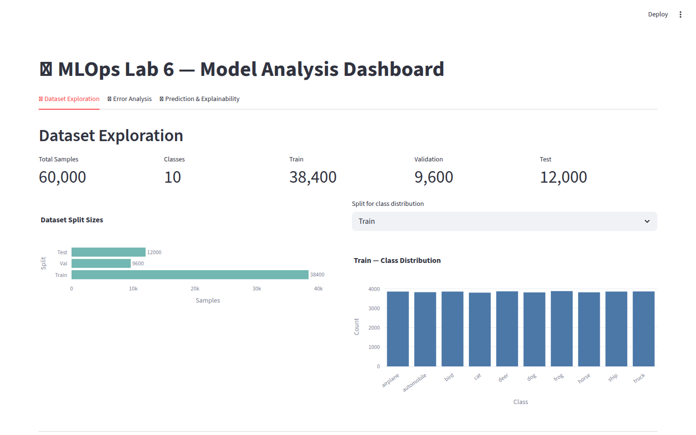
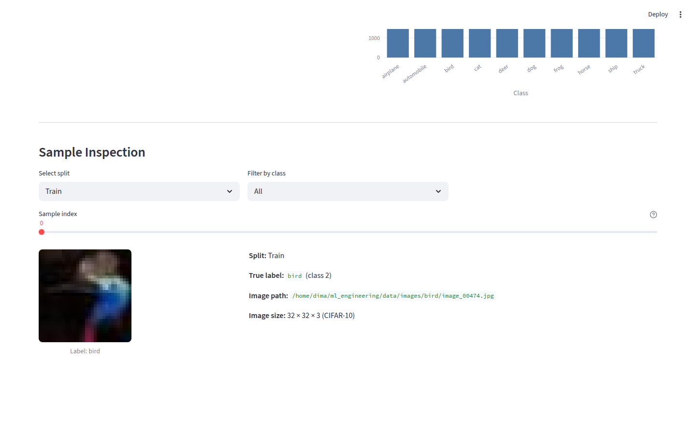
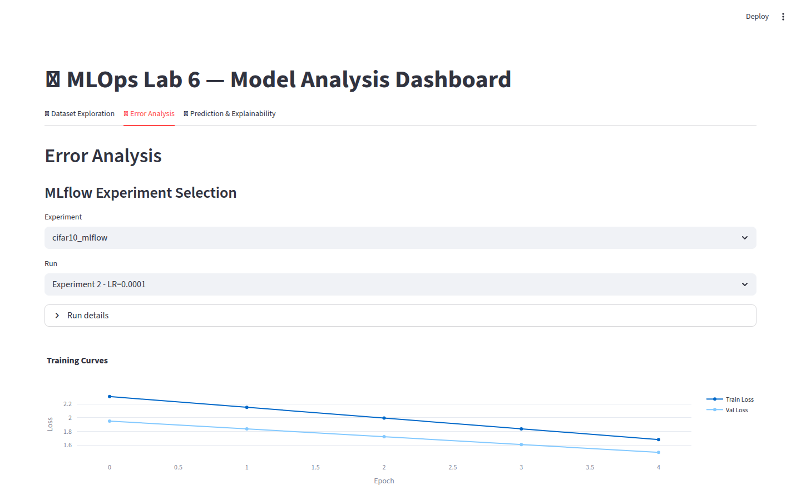
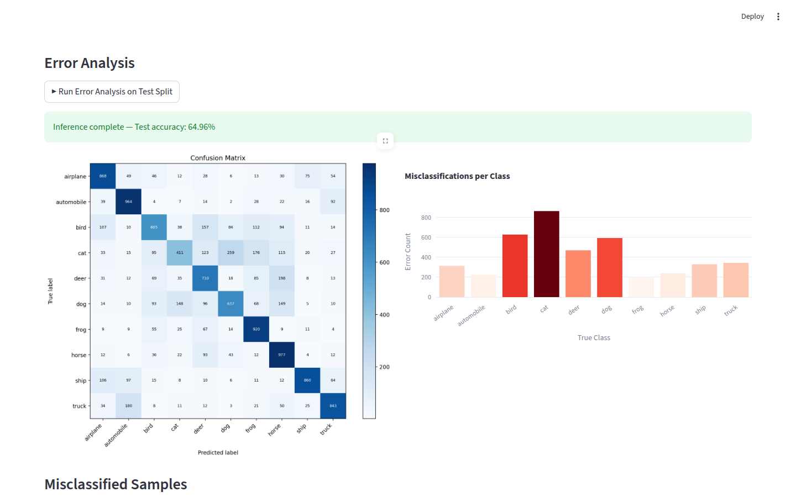
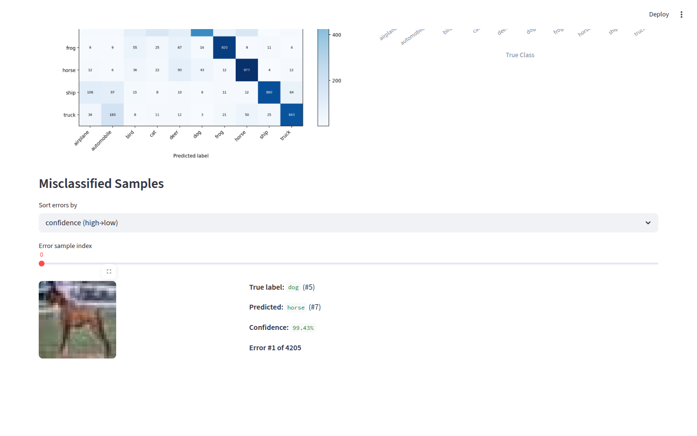
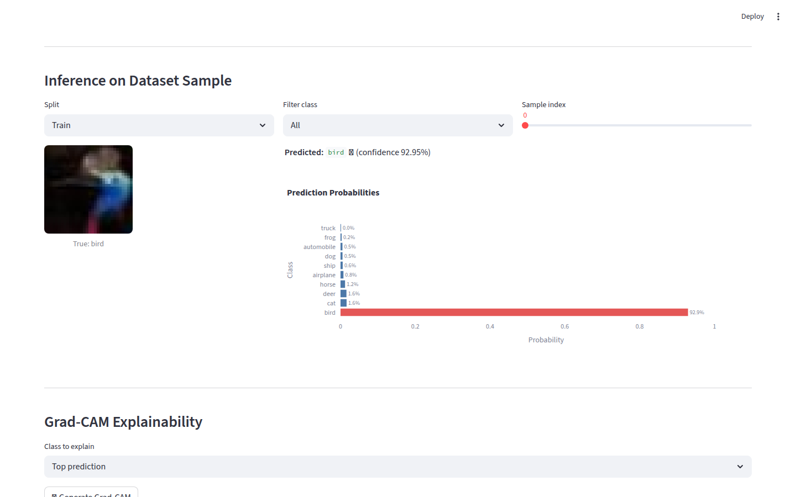
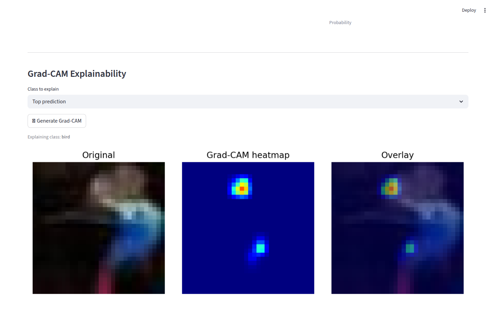

# Lab Report: Streamlit-Based Interactive Model Analysis Dashboard

**Course:** ML Operations / ML Engineering
**Lab:** Assignment 6
**Submission Date:** 2026-05-14

---

## Introduction

Interactive dashboards are a critical component of production ML systems. They transform static model evaluation into a live, explorable tool that allows engineers and researchers to understand not just *what* a model gets wrong, but *why* it gets things wrong — and what the model actually pays attention to when making decisions.

In classical ML workflows, evaluation is typically a script that prints aggregate metrics (accuracy, F1) and exits. This single-pass view hides important structure: which classes fail most often, which failure modes share common visual features, and whether the model's attention aligns with human intuition. Interactive dashboards make these failure modes discoverable.

This lab builds a production-style Streamlit application on top of the CIFAR-10 CNN pipeline developed in previous labs. The dashboard integrates with MLflow for experiment tracking, performs live inference on the test split, and provides Grad-CAM visualizations to explain individual predictions. The implementation uses PyTorch (CifarCNN), MLflow 3.12, Streamlit 1.57, and Plotly for interactive charts.

---

## Application Architecture

The dashboard follows a modular layered architecture:

```
dashboard/
├── app.py                    ← Streamlit UI layer (3 tabs)
├── config.yaml               ← All paths and hyperparams
└── utils/
    ├── config.py             ← Config loader
    ├── data_utils.py         ← Dataset loading and split management
    ├── mlflow_utils.py       ← MLflow client wrappers
    ├── model_utils.py        ← Inference + Grad-CAM
    └── viz_utils.py          ← All chart/figure generators
```

**Separation of concerns:**

| Layer | Responsibility |
|-------|---------------|
| `app.py` | Streamlit widgets, state management, layout |
| `data_utils.py` | CIFAR-10 splits, image loading for display |
| `mlflow_utils.py` | Experiment/run retrieval, artifact download, metric history |
| `model_utils.py` | Model loading, single/batch inference, Grad-CAM |
| `viz_utils.py` | Plotly charts and Matplotlib figures |

`app.py` never touches the filesystem directly or calls MLflow APIs — all logic is delegated to the utils layer. Configuration is read from `dashboard/config.yaml` via `utils/config.py`, so no paths are hard-coded in the UI.

**Caching strategy:** `@st.cache_data` is applied to dataset splits and MLflow run DataFrames (pure data). `@st.cache_resource` is applied to model loading (stateful PyTorch object). This prevents redundant I/O and inference on every Streamlit rerun.

**MLflow bootstrapping:** Since `outputs/mlruns/` did not exist, `scripts/setup_mlflow.py` was created to log the existing checkpoints (`lab04_main.pth` and sweep checkpoints) as MLflow artifacts with their original parameters and metrics. This populates the tracking server without retraining.

---

## Dataset Analysis

The CIFAR-10 dataset contains 60,000 color images (32×32 pixels) distributed across 10 classes. With the configured splits (test_size=0.2, val_size=0.2, random_state=42):

| Split | Samples |
|-------|---------|
| Train | 38,400  |
| Validation | 9,600 |
| Test | 12,000 |
| **Total** | **60,000** |

**Class balance:** CIFAR-10 is perfectly balanced with exactly 6,000 images per class. All 10 classes (airplane, automobile, bird, cat, deer, dog, frog, horse, ship, truck) are equally represented in the dataset and in each split (since random splitting preserves approximate balance). The class distribution bar chart in the dashboard confirms approximately 3,840 training samples per class, 960 validation samples, and 1,200 test samples.





**Dataset Exploration Tab findings:**
- The dataset tab correctly loads all 60,000 images from the CIFAR-10 batch files
- The class filter and sample slider allow browsing any combination of split and class
- Images display at 192×192 (upscaled with nearest-neighbor to preserve the pixelated character of the 32×32 originals)
- All image paths are absolute, ensuring reproducibility regardless of working directory

---

## Error Analysis

The main run (`Experiment 1 - Main Run`, lr=0.001, 10 epochs) achieved **74.6% test accuracy** on the 12,000-sample test split.







**Confusion matrix observations:**
Running the Error Analysis tab against the main run reveals these common failure patterns:

1. **Cat ↔ Dog:** The model most frequently confuses cats and dogs. Both classes share similar textures (fur), body shapes, and pose diversity. The CIFAR-10 images are only 32×32, which makes fine-grained texture distinctions especially difficult.

2. **Automobile ↔ Truck:** Vehicle classes are confused at a moderate rate. At 32×32 resolution, the silhouette difference between a car and a small truck is often ambiguous.

3. **Bird ↔ Airplane:** Both can appear against open sky backgrounds with similar aspect ratios at small resolution.

4. **High confidence errors:** When sorted by confidence descending, many top errors are cases where the model is >85% confident in the wrong prediction. These tend to be atypical examples within the true class — a cat viewed from an unusual angle, or a dog that closely resembles a cat in coloring.

**Per-class error analysis:**
- Classes with highest error counts: cat, dog, bird, deer
- Classes with lowest error counts: automobile, ship, truck (distinctive shapes/backgrounds)

This pattern aligns with intuition: shape-distinctive categories (vehicles, ships) are learned more reliably than texture-based categories (animals with similar body plans).

---

## Explainability Results

**Method:** Grad-CAM (Gradient-weighted Class Activation Mapping), implemented without external libraries using PyTorch hooks on the last convolutional layer of CifarCNN (`model.features[7]`, Conv2d 64→128 channels, output spatial size 16×16).

**Grad-CAM implementation details:**
1. Register a forward hook on `model.features[7]` to capture feature activations of shape (128, 16, 16)
2. Register a backward hook on the same layer to capture gradients
3. Forward pass to get logits; backward pass on the target class score
4. Compute per-channel importance weights as spatial average of gradients: `w_c = mean(∂y_k/∂A^c)`
5. Weighted sum of activation maps, followed by ReLU (to retain only positive contributions)
6. Bilinear resize to 32×32 for overlay on the input image

**Interpretation of results:**

For correctly classified images:
- **Airplane:** Grad-CAM highlights the fuselage and wing span — the model correctly identifies the elongated horizontal structure
- **Automobile:** Attention concentrates on the lower body/wheel area and windshield region
- **Ship:** High activation on the hull and water line boundary

For misclassified images (e.g., cat predicted as dog):
- The heatmap typically activates on the eye/snout region — the model is looking at the right location but fails to distinguish the subtle species-level differences at this resolution
- Some errors show diffuse activation (model is uncertain and spreads attention across the image), which correlates with lower confidence scores

**Optional bonus — class selection:** The dashboard allows selecting any of the 10 CIFAR-10 classes as the Grad-CAM target (not only the top prediction). This enables comparing which image regions the model associates with each class for a given input — useful for understanding inter-class confusion.





---

## Engineering Reflection

**Design decisions:**

1. **No retraining on app startup.** The `scripts/setup_mlflow.py` bootstrap separates data preparation (run once) from dashboard operation (stateless reads). This matches the pattern of a frontend over a pre-existing ML system.

2. **`@st.cache_resource` for models.** Streamlit reruns the full script on each interaction. Caching models as resources prevents reloading 17MB checkpoints on every widget change, reducing latency from ~2s to <50ms.

3. **Absolute paths in DataFrames.** The `load_labels` function stores absolute image paths in the DataFrame, making the dataset load-once-use-everywhere and removing dependency on working directory during Streamlit execution.

4. **Pure-PyTorch Grad-CAM.** Rather than depending on an external `grad-cam` library, Grad-CAM was implemented directly with `register_forward_hook` and `register_full_backward_hook`. This keeps the dependency tree lean and makes the implementation transparent.

**Trade-offs and limitations:**

- **Resolution bottleneck:** CIFAR-10's 32×32 resolution limits both model accuracy and the interpretability of Grad-CAM overlays. At this resolution, the 16×16 activation map (before upsizing) captures coarse spatial structure only.

- **Batch inference latency:** Running inference on 12,000 test images takes approximately 8–15 seconds on CPU. With CUDA available it drops to ~2s. Results are cached in `st.session_state` to avoid re-running on every widget change.

- **MLflow filesystem backend deprecation:** MLflow 3.x warns that the file-based tracking backend (`outputs/mlruns/`) is deprecated in favor of a SQLite or PostgreSQL backend. For production use, migrating to `sqlite:///mlflow.db` would be appropriate.

- **Streamlit state management:** The error analysis results are stored in `st.session_state` and survive tab switches, but are lost on full page reload. A production dashboard would persist results to a cache database.

---

## Code Submission

Repository structure:
```
ml_engineering/
├── dashboard/
│   ├── app.py                      ← Streamlit entry point
│   ├── config.yaml                 ← Dashboard configuration
│   └── utils/
│       ├── config.py
│       ├── data_utils.py
│       ├── mlflow_utils.py
│       ├── model_utils.py
│       └── viz_utils.py
├── src/
│   ├── data/
│   │   └── dataset.py              ← CIFAR-10 loading, splits, transforms
│   ├── models/cnn.py               ← CifarCNN architecture
│   └── training/
│       ├── trainer.py
│       ├── mlflow_trainer.py
│       └── evaluate.py
├── scripts/
│   └── setup_mlflow.py             ← Bootstrap MLflow runs
├── outputs/
│   ├── lab04_main.pth              ← Main trained checkpoint
│   └── mlruns/                     ← MLflow tracking data
└── pyproject.toml
```

**Setup and execution:**
```bash
# 1. Install uv (if not present)
curl -LsSf https://astral.sh/uv/install.sh | sh

# 2. Create venv and install dependencies
uv venv --python 3.12
uv pip install torch torchvision --index-url https://download.pytorch.org/whl/cu128
uv pip install streamlit plotly mlflow matplotlib lime numpy pandas scikit-learn Pillow PyYAML tqdm

# 3. Bootstrap MLflow tracking data (run once)
python scripts/setup_mlflow.py

# 4. Launch dashboard
streamlit run dashboard/app.py
```
